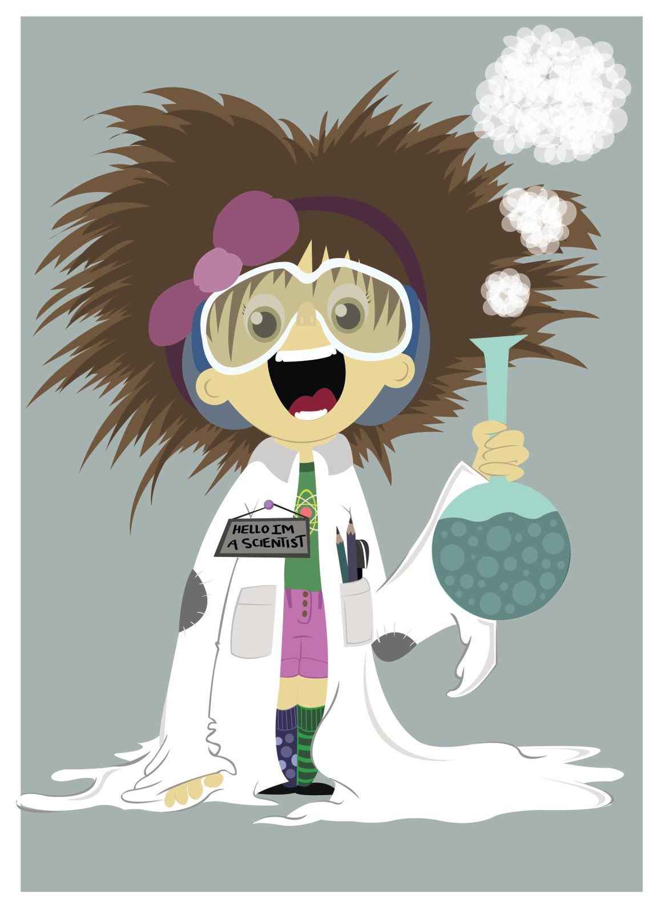

# Spring 2020 ComBio Class Assignments List

## __[Homework1: Typoradoc Bio381](Bio381.html)__

## __[Homework2: Regular expressions](Homework4.html)__

## __[Homework3: Vectors in R](Vector_in_R.html)__

## __[Homework4: Matrices, Lists and DataFrames](Matrix_List_DataFrames.html)__

## __[Homework5: Probability Distribution](Homework5.html)__